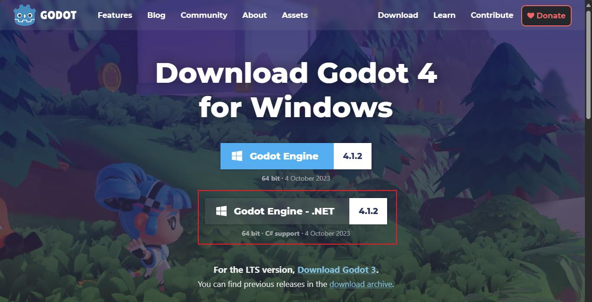
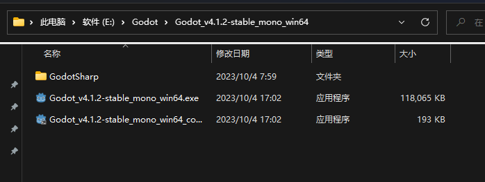

# Use GDExtension to create game
- [Use GDExtension to create game](#use-gdextension-to-create-game)
  - [电脑配置](#电脑配置)
    - [设备规格](#设备规格)
    - [Windows规格](#windows规格)
  - [第一步：GDExtension环境搭建](#第一步gdextension环境搭建)
    - [1. 下载Godot](#1-下载godot)
    - [2. C++编译器](#2-c编译器)

在前段时间Unity的风波下，我毅然放弃了Unity的学习，并在Unreal和Godot引擎两者中开始选择。

起初摇摆不定，秉着不亏的想法把C++学了，后来在了解到godot引擎的开源性以及也支持C++，所以决定尝试使用godot引擎，并使用c++来进行游戏开发。

本项目记录着我按照官方文档进行C++开发环境的步骤，其中包含一些个性化的调整。希望能够帮助到同样想在godot上用C++语言写一下模块的朋友。

申明：本人是代码小白，初学C++和各游戏引擎，项目中如若有不妥之处，还请路过的大佬多多指正！

## 电脑配置

### 设备规格
    处理器	12th Gen Intel(R) Core(TM) i5-12400   2.50 GHz
    机带 RAM	32.0 GB (31.3 GB 可用)
    设备 ID	BECB0BBD-F8A2-4E25-A402-7B956F6460A0
    产品 ID	00325-81389-01441-AAOEM
    系统类型	64 位操作系统, 基于 x64 的处理器
### Windows规格
    版本	Windows 11 家庭版
    版本	21H2
    安装日期	‎2022/‎5/‎31
    操作系统版本	22000.2538
    体验	Windows 功能体验包 1000.22001.1000.0

## 第一步：GDExtension环境搭建
### 1. 下载Godot
Godot前不久更新了4.1.2版本，就用这个版本来跟着官方文档进行环境搭建吧

因为比较熟C#代码，所以我选择下载了4.1.2的.Net版本

下载完成后我放到了E盘的Godot文件下进行了解压，路径为：

        E:\Godot\Godot_v4.1.2-stable_mono_win64
        ## 这个路径在后续编译调试的时候会用得上，所以要特别注意下

下方是目录状况：

以上，就完成了Godot引擎的下载了。
### 2. C++编译器

