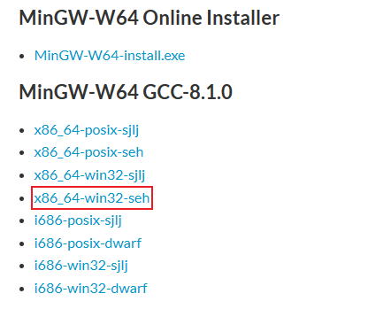
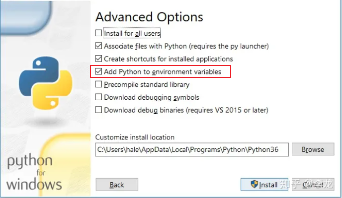
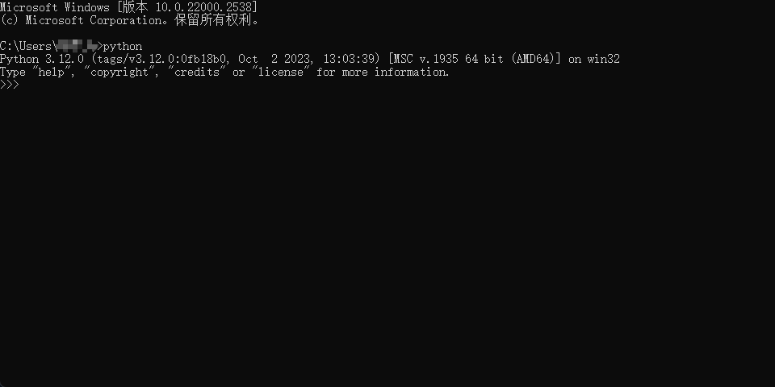
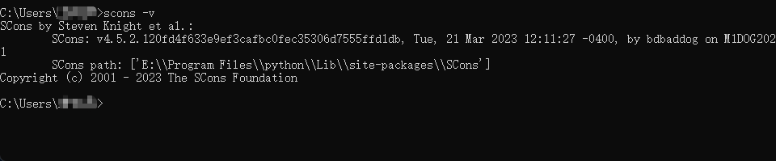
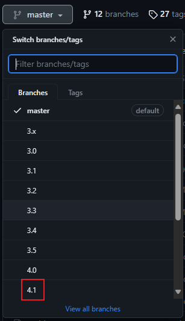
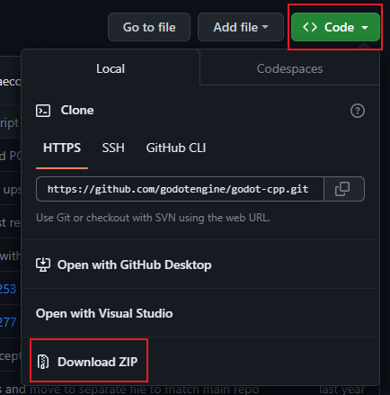

# Use GDExtension to create game

## 目录
- [Use GDExtension to create game](#use-gdextension-to-create-game)
  - [目录](#目录)
  - [写在前面](#写在前面)
    - [电脑配置](#电脑配置)
      - [设备规格](#设备规格)
      - [Windows规格](#windows规格)
  - [第一步：GDExtension环境搭建](#第一步gdextension环境搭建)
    - [1. 下载Godot](#1-下载godot)
    - [2. C++编译器](#2-c编译器)
    - [3. 安装python以及Scons工具](#3-安装python以及scons工具)
    - [4. 下载官方的godot-cpp工具包](#4-下载官方的godot-cpp工具包)

## 写在前面
在前段时间Unity的风波下，我毅然放弃了Unity的学习，并在Unreal和Godot引擎两者中开始选择。

起初摇摆不定，秉着不亏的想法把C++学了，后来在了解到godot引擎的开源性以及也支持C++，所以决定尝试使用godot引擎，并使用c++来进行游戏开发。

本项目记录着我按照官方文档进行C++开发环境的步骤，其中包含一些个性化的调整。希望能够帮助到同样想在godot上用C++语言写一下模块的朋友。

申明：本人是代码小白，初学C++和各游戏引擎，项目中如若有不妥之处，还请路过的大佬多多指正！

### 电脑配置

#### 设备规格
    处理器	12th Gen Intel(R) Core(TM) i5-12400   2.50 GHz
    机带 RAM	32.0 GB (31.3 GB 可用)
    设备 ID	BECB0BBD-F8A2-4E25-A402-7B956F6460A0
    产品 ID	00325-81389-01441-AAOEM
    系统类型	64 位操作系统, 基于 x64 的处理器
#### Windows规格
    版本	Windows 11 家庭版
    版本	21H2
    安装日期	‎2022/‎5/‎31
    操作系统版本	22000.2538
    体验	Windows 功能体验包 1000.22001.1000.0

## 第一步：GDExtension环境搭建
### 1. 下载Godot
Godot前不久更新了4.1.2版本，就用这个版本来跟着官方文档进行环境搭建吧

因为比较熟C#代码，所以我选择下载了4.1.2的.Net版本

下载完成后我放到了E盘的Godot文件下进行了解压，路径为：

        E:\Godot\Godot_v4.1.2-stable_mono_win64
        ## 这个路径在后续编译调试的时候会用得上，所以要特别注意下

下方是目录状况：

以上，就完成了Godot引擎的下载了。
### 2. C++编译器
C++编译器有很多，这里我选择了Visual Studio Code作为编译器，主要还是因为其轻量，使用其他语言也很方便。

网上vscode的C++环境搭建教程有很多，这里我就简单提一嘴，我用的MinGW-W64轻量级GNU工具链，下载链接在下方：

    https://sourceforge.net/projects/mingw-w64/files/Toolchains%20targetting%20Win64/Personal%20Builds/mingw-builds/

简单在环境变量里设置一下，就能在Vscode里写C++了，这里就不具体演示了。

### 3. 安装python以及Scons工具
安装python也是没什么讲究，我是直接官网上下载了python3.12.0版本，然后直接安装就行了。

注意提一点：安装过程中记得勾一下环境配置，这样使用上会更方便一点。

安装好后使用快捷键Win + R启动，然后输入cmd启动运行，测试下python是否安装成功。

正常展示出版本信息就说明安装成功啦，关掉界面然后重新来一次快捷键Win + R启动，然后输入cmd启动运行，这次我们要安装Scons。

在cmd界面内输入下方指令：

    pip install Scons 

如果在国内，可以使用清华源，会下的快一点    

    pip install Scons -i https://pypi.tuna.tsinghua.edu.cn/simple some-package

接下来稍等片刻，在安装好后输入下方指令，确认下安装版本
    
    scons -v

如果你也和我一样出现了上图的结果，就说明你的Scons工具也安装好啦！

### 4. 下载官方的godot-cpp工具包
为了方便大家我贴一下官方的工具包链接：

    https://github.com/godotengine/godot-cpp

首先有一点要注意的官方的README里所说的：

    This repository's master branch is only usable with GDExtension from Godot's master branch.
    For users of stable branches, switch to the branch matching your target Godot version.

简单来说就是注意好版本，因为每个版本都有自己对应的工具包，如果下错了，就算编译成功，在godot里也是没法用的。

因为下载的是Godot_v4.1.2，所以我们直接来到网页的左上方，选择4.1版本的分支进行切换

然后直接点击右侧的Code，直接下zip就好了（我还不太会用Desktop，就偷懒用解压包了）。

